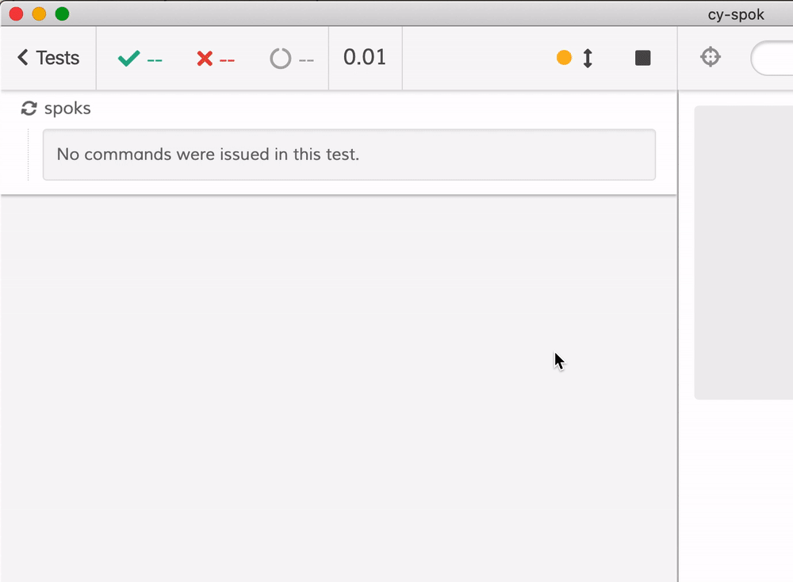
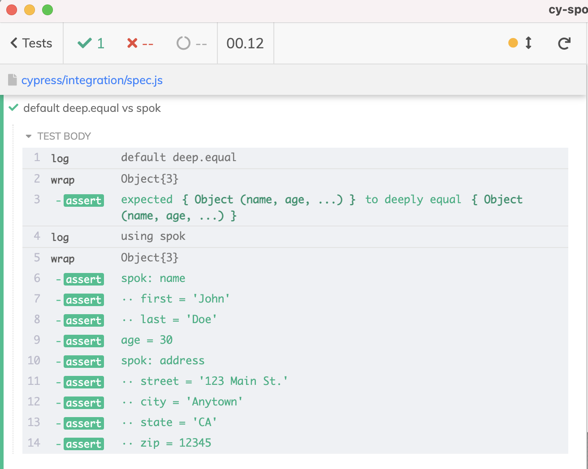
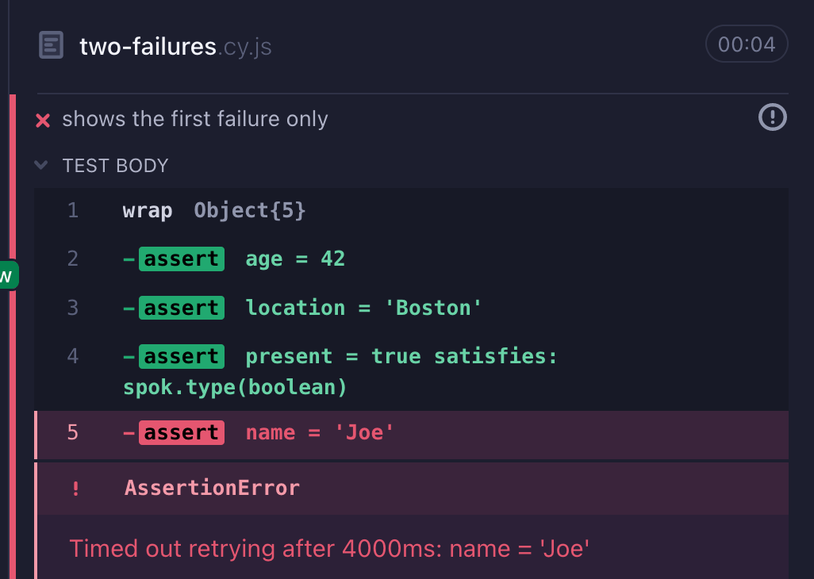

# cy-spok [![renovate-app badge][renovate-badge]][renovate-app] 

> Playing with [spok](https://github.com/thlorenz/spok) inside Cypress test

<!-- prettier-ignore-start -->
CI | status
--- | ---
[lint](.github/workflows/lint.yml) | 
[badges](.github/workflows/badges.yml) | 
[cy-spok](.github/workflows/main.yml) | 
[cy-spok-example](https://github.com/bahmutov/cy-spok-example) | 
<!-- prettier-ignore-end -->

## Learn

- 📺 Watch [Introduction To cy-spok Plugin For Writing Powerful Assertions For Objects](https://www.youtube.com/watch?v=MLDsqBd_gVU)
- 📺 Watch [Confirm Text In Multiple Page Elements Using cy-spok](https://youtu.be/l6_OXPiqkxQ)
- 📝 Read [Asserting Network Calls from Cypress Tests](https://www.cypress.io/blog/2019/12/23/asserting-network-calls-from-cypress-tests/)
- 📝 Read [Change E2E Tests From UI To API To App Actions](https://glebbahmutov.com/blog/ui-to-api-to-app-actions/)
- 📝 Read [Two Simple Tricks To Make Your Cypress Tests Better](https://glebbahmutov.com/blog/two-cypress-tricks/)
- 📝 Read [Crawl Weather Using Cypress](https://glebbahmutov.com/blog/crawl-weather/)
- 🎓 Covered in my course [Cypress Plugins](https://cypress.tips/courses/cypress-plugins)
  - [Lesson e1: Validate network requests using cy-spok](https://cypress.tips/courses/cypress-plugins/lessons/e1)
  - [Lesson e2: Use your own predicates to validate object properties](https://cypress.tips/courses/cypress-plugins/lessons/e2)
  - [Lesson e3: Validate URL search parameters](https://cypress.tips/courses/cypress-plugins/lessons/e3)
  - [Lesson e4: Check and control the Redux store using cy-spok plugin](https://cypress.tips/courses/cypress-plugins/lessons/e4)
- 🎓 Covered in my course [Cypress Network Testing Exercises](https://cypress.tips/courses/network-testing)
  - [Bonus 28: Use cy-spok plugin to write complex assertions](https://cypress.tips/courses/network-testing/lessons/bonus28)
  - [Bonus 101: Confirm the server supports caching using the ETag header](https://cypress.tips/courses/network-testing/lessons/bonus101)

## Install

```
$ npm i -D cy-spok
```

## Use

See [spok](https://github.com/thlorenz/spok#readme) docs

```js
// in your Cypress spec file
import spok from 'cy-spok'

const object = {
  one: 1,
  two: 2,
  three: 3,
  four: 4,
  helloWorld: 'hello world',
  anyNum: 999,
  anotherNum: 888,
  anArray: [1, 2],
  anotherArray: [1, 2, 3],
  anObject: {},
  id: 'abc123',
  list: ['one', 'two', 'three'],
}

// using Spok
// https://github.com/thlorenz/spok#readme
cy.wrap(object, { timeout: 2000 }).should(
  spok({
    $topic: 'spok-example', // optional
    one: spok.ge(1),
    two: 2,
    three: spok.range(2, 6),
    four: spok.lt(5),
    helloWorld: spok.startsWith('hello'),
    anyNum: spok.type('number'),
    anotherNum: spok.number,
    anArray: spok.array,
    anObject: spok.ne(undefined),
    // test a string using regular expression
    id: spok.test(/^abc\d{3}$/),
    // array with 3 elements
    list: spok.arrayElements(3),
  }),
)
```

See [cypress/integration/spec.js](cypress/integration/spec.js) here and in the [cy-spok-example](https://github.com/bahmutov/cy-spok-example) repo.



## vs deep.equal

Spok prints a lot more information when using it compared to `deep.equal`. Note that Spok is a subset, not strict value equality.



See [deep-equal-spec.js](./cypress/integration/deep-equal-spec.js)

## Treat arrays as an object

```js
// verify each item in an array as an object
cy.wrap(['one', 42, 'three']).should(
  spok({
    0: spok.string,
    1: spok.number,
    2: spok.string,
  }),
)
```

## Use Lodash predicates

Lodash has many predicate functions `is...`, see [Lodash docs](https://lodash.com/docs)

```js
cy.wrap({
  name: 'Joe',
  age: 20,
}).should(
  spok({
    name: Cypress._.isString,
    age: Cypress._.isNumber,
  }),
)
```

## Own predicate

Any synchronous function that returns a boolean could be a predicate

```js
// it is a list of strings
const areGreetings = (list) =>
  Array.isArray(list) && list.every(Cypress._.isString)

cy.wrap({
  greetings: ['hello', 'hi'],
}).should(
  spok({
    greetings: areGreetings,
  }),
)
```

## First failure only

If there are multiple failing predicates, only the first one is shown. All passing predicates are shown

```js
cy.wrap({
  name: 'Joe',
  age: 42,
  job: 'chimney sweeper',
  location: 'Boston',
  present: true,
}).should(
  spok({
    name: 'Mary', // fails
    age: 42, // passes
    job: 'secret agent', // fails
    location: 'Boston', // passes
    present: spok.type('boolean'), // passes
  }),
)
```



## Small print

Author: Gleb Bahmutov &lt;gleb.bahmutov@gmail.com&gt; &copy; 2021

- [@bahmutov](https://twitter.com/bahmutov)
- [glebbahmutov.com](https://glebbahmutov.com)
- [blog](https://glebbahmutov.com/blog)
- [videos](https://www.youtube.com/glebbahmutov)
- [presentations](https://slides.com/bahmutov)
- [cypress.tips](https://cypress.tips)
- [Cypress Advent 2021](https://cypresstips.substack.com/)

License: MIT - do anything with the code, but don't blame me if it does not work.

Support: if you find any problems with this module, email / tweet /
[open issue](https://github.com/bahmutov/cy-spok/issues) on Github

## MIT License

Copyright (c) 2021 Gleb Bahmutov &lt;gleb.bahmutov@gmail.com&gt;

Permission is hereby granted, free of charge, to any person
obtaining a copy of this software and associated documentation
files (the "Software"), to deal in the Software without
restriction, including without limitation the rights to use,
copy, modify, merge, publish, distribute, sublicense, and/or sell
copies of the Software, and to permit persons to whom the
Software is furnished to do so, subject to the following
conditions:

The above copyright notice and this permission notice shall be
included in all copies or substantial portions of the Software.

THE SOFTWARE IS PROVIDED "AS IS", WITHOUT WARRANTY OF ANY KIND,
EXPRESS OR IMPLIED, INCLUDING BUT NOT LIMITED TO THE WARRANTIES
OF MERCHANTABILITY, FITNESS FOR A PARTICULAR PURPOSE AND
NONINFRINGEMENT. IN NO EVENT SHALL THE AUTHORS OR COPYRIGHT
HOLDERS BE LIABLE FOR ANY CLAIM, DAMAGES OR OTHER LIABILITY,
WHETHER IN AN ACTION OF CONTRACT, TORT OR OTHERWISE, ARISING
FROM, OUT OF OR IN CONNECTION WITH THE SOFTWARE OR THE USE OR
OTHER DEALINGS IN THE SOFTWARE.

[renovate-badge]: https://img.shields.io/badge/renovate-app-blue.svg
[renovate-app]: https://renovateapp.com/
